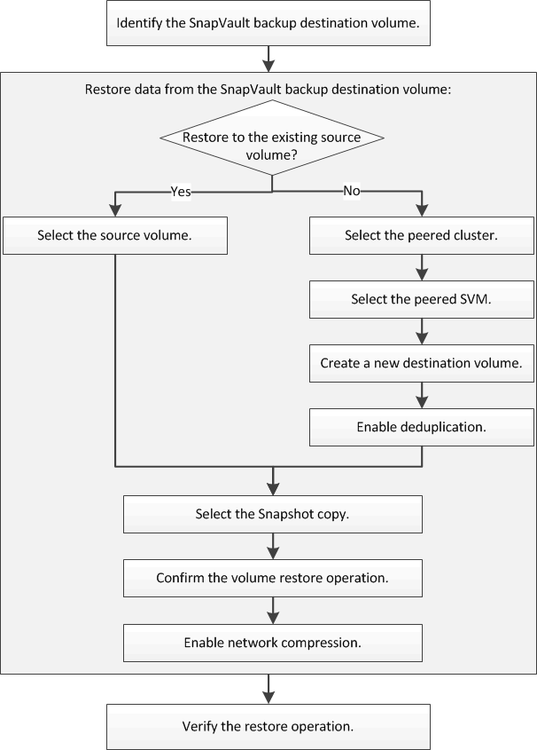

= Volume還原工作流程
:allow-uri-read: 
:icons: font
:imagesdir: ../media/

[role="lead"]
當來源Volume無法使用或資料毀損時、您可以從SnapVault 還原備份執行還原。從SnapVault 還原磁碟區的功能包括選擇SnapVault 還原目的地磁碟區、將磁碟區還原至新的磁碟區或現有的磁碟區、以及驗證還原作業。

